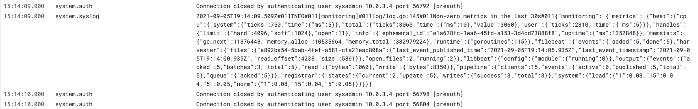
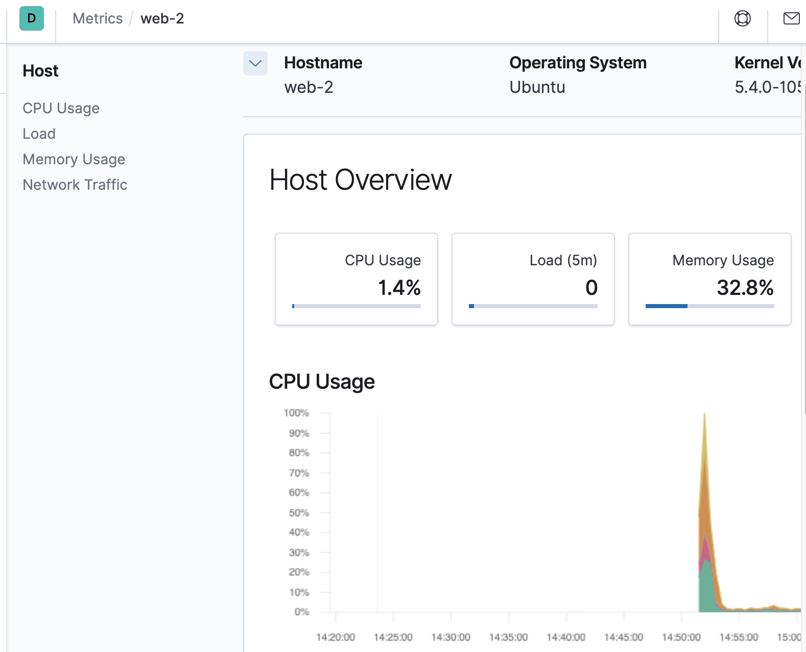

## Automated ELK Stack Deployment

The files in this repository were used to configure the network depicted below.

These files have been tested and used to generate a live ELK deployment on Azure. They can be used to either recreate the entire deployment pictured above. Alternatively, select portions of the yml configuration file may be used to install only certain pieces of it, such as Filebeat.

  - filebeat-playbook.yml
  - metricbeat-playbook.yml

This document contains the following details:
- Description of the Topology
- Access Policies
- ELK Configuration
  - Beats in Use
  - Machines Being Monitored
- How to Use the Ansible Build

### Description of the Topology

The main purpose of this network is to expose a load-balanced and monitored instance of DVWA, the D*mn Vulnerable Web Application.

Load balancing ensures that the application will be highly redundant, in addition to restricting access to the network.
- The load balancer helps mitigate DoS attacks by having multiple servers runnig the same websites
- The load balancer distributes traffic evenly among the servers running the same website when they're added to its backend pool.
- The jumpbox allows connection from a specific machince over the internet and it is the only way to access, configured and manage the webservers and the elk server. 

Integrating an ELK server allows users to easily monitor the vulnerable VMs for changes to the CPU usage, memory, files system, disk IO, network IO and system logs.

- Filebeat collects systems log files and forwards it to a Elasticsearch and Logstach.
- Metribeat collects CPU usage, memory usage, changes in file systems, disk IO and network IO.

The configuration details of each machine may be found below.

| Name                | Function          | IP Address | Operating System |
|---------------------|-------------------|------------|------------------|
| JumpBox-Provisioner | Gateway           | 10.0.0.4   | Linux            |
| web-1               | webserver         | 10.0.1.4   | Linux            |
| web-2               | webserver         | 10.0.1.5   | Linux            |
| web-3               | webserver         | 10.0.1.6   | Linux            |
| ELK-VM              | Monitoring Server | 10.1.1.4   | Linux            |

### Access Policies

The machines on the internal network are not exposed to the public Internet. 

Only the JumpBox-Provisioner machine can accept connections from the Internet. Access to this machine is only allowed from the following IP addresses:
- 99.102.208.218

Machines within the network can only be accessed by JumpBox-Provisioner.
- 10.1.1.4, 10.0.1.4, 10.0.1.5 and 10.0.1.6 are the machines within the network that can be accessed by JumpBox-Provisioner

A summary of the access policies in place can be found in the table below.

| Name                | Publicly Accessible | Allowed IP Address  |
|---------------------|---------------------|---------------------|
| JumpBox Provisioner | Yes                 | 99.102.208.218      |
| web-1               | No                  | 10.0.0.4            |
| web-2               | No                  | 10.0.0.4            |
| web-3               | No                  | 10.0.0.4            |
| ELK-VM              | No                  | 10.0.0.4            |

### Elk Configuration

Ansible was used to automate configuration of the ELK machine. No configuration was performed manually, which is advantageous because it saves time and reduces the need for human interaction with each VMs which could cause misconfiguration

The playbook implements the following tasks:
- Used the ansible sysctl module to allow VM to user more memory
- Installed docker.io on the ELK servers to for linux cointainers.
- Installed python module/libary for docker
- Installed sebp/elk:761 container on the elk-vm, enabled ports 5601:5601, 3200:9200, 5044:5044, and start restart policy to always
- Enabled docker service 

The following screenshot displays the result of running `docker ps` after successfully configuring the ELK instance.

### Target Machines & Beats
This ELK server is configured to monitor the following machines:
- 10.0.1.4
- 10.0.1.5
- 10.0.1.6

We have installed the following Beats on these machines:
- Filebeat
- Metricbeat

These Beats allow us to collect the following information from each machine:
- Filebeats collects sys.log and auth.log from the machince is it configured to monitor. See example below:

- Metribeats collects uptime, memory usage, CPU usage and network trafic from the machince or container is configured to monitor. See example below:

### Using the Playbook
In order to use the playbook, you will need to have an Ansible control node already configured. Assuming you have such a control node provisioned: 

SSH into the control node and follow the steps below:
- Copy the the IP configured in the ansible host file to the ansible playbook.
- Update the playbook file to include the following:
  - Hosts from ansible host file modified i.e webserver or db group
  - Add task you want the provisioner to perform such as installing a package or make system configuration
- Run the playbook, and navigate to the machine to check that the installation worked as expected.
- The elk ansible playbook file is the elk-config file. It can be copied from the linux folder.
- Modify the hosts in the elk-config playbook to specify which machine to want the playbook to run. The host needs to be from one of the groups in the ansible host file. 
  - Example:
    hosts: elk
- Navigate to <localhost:5601> to valiadate the if elk server is up and running. 

- Command to update and run the ansible playbook
  - vi elk-config.yml to open and modify the yml file. Save and exit
  - Run ansible-playbooy elk-config.yml to configure the elk machine